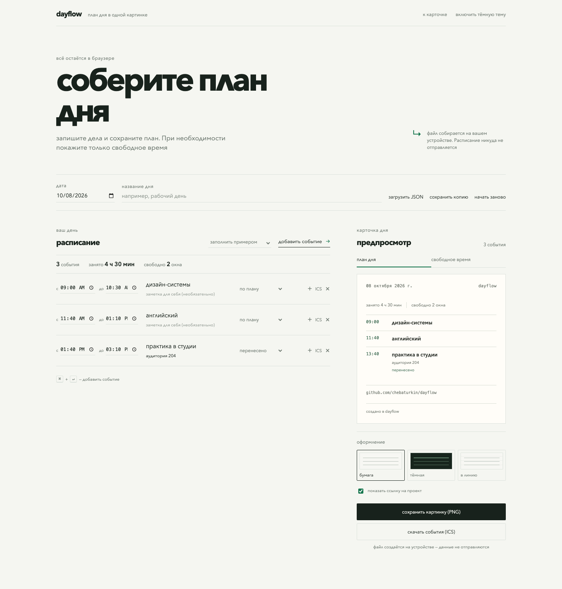
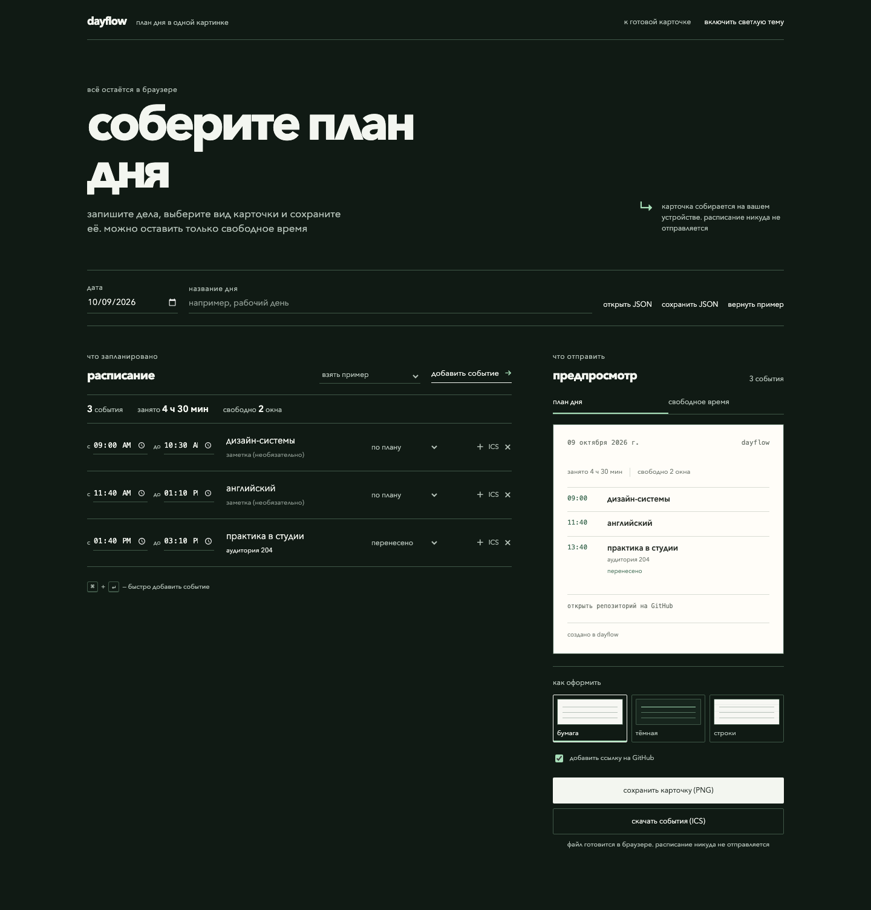

# dayflow

небольшой local-first редактор карточек из расписания: занятия можно менять прямо в браузере, отменённые не попадают в итог, а готовую карточку можно сохранить как png.





## запуск

```bash
npm install
npm run dev
```

## что внутри

- редактируемый список занятий;
- примеры учебного и рабочего дня и чистый лист;
- сохранение в браузере;
- светлая и тёмная тема;
- три спокойных оформления карточки;
- экспорт отдельного занятия в ICS;
- экспорт всей карточки дня в PNG;
- тесты логики расписания и календарного файла.

данные никуда не отправляются.

## лицензия

MIT
